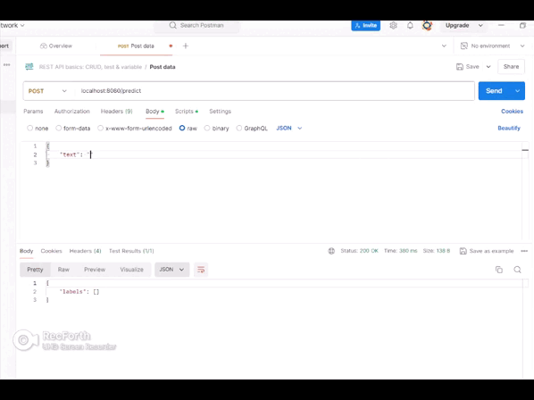

# Мультилейбл классификация текста с BERT

Проект для многоклассовой классификации текстов с использованием BERT и PyTorch. Включает обучение модели, предсказание меток и REST API для взаимодействия с моделью.

## Особенности
- Поддержка многоклассовой классификации
- Использование предобученной модели `bert-base-multilingual-cased`
- REST API на FastAPI для предсказаний
- Логирование обучения и предсказаний
- Предобработка текста (очистка, нормализация)

## Установка

1. Клонируйте репозиторий:
```bash
git clone https://github.com/Abrazacs/nlp_multilable_classification.git
cd nlp_multilable_classification
```
## Особенности
- Поддержка многоклассовой классификации
- Использование предобученной модели `bert-base-multilingual-cased`
- REST API на FastAPI для предсказаний
- Логирование обучения и предсказаний
- Предобработка текста (очистка, нормализация)

## Установка

1. Клонируйте репозиторий:
```bash
git clone https://github.com/Abrazacs/nlp_multilable_classification.git
cd nlp_multilable_classification
```

2. Установите зависимости:
```bash
pip install -r requirements.txt
```

# Использование
## Обучение модели
Поместите ваш датасет dataset.csv в корневую директорию (формат: колонки text и labels, где labels разделены запятыми).

Запустите обучение:
```bash
python train_classifier_multilabel.py
```

## Настройки обучения
Настройки обучения можно изменить прямо в скрипте:

`num_epochs` - количество эпох

`batch_size` - размер батча

`learning_rate` - скорость обучения

## Запуск API
После обучения модели запустите FastAPI сервер:
```bash
uvicorn app:api --port 8080 --reload
```
API доступно по адресу http://127.0.0.1:8000

### Методы API:

`GET /` - Проверка работы сервера

`POST /predict` - Предсказание меток для текста

Пример запроса:

```bash
curl -X POST "http://127.0.0.1:8000/predict" \
-H "Content-Type: application/json" \
-d '{"text":"Пример текста для классификации"}'
```

Запрос:
```json
{
  "text": "Со счетом 2:1 мы выиграли у Англичан"
}
```
Ответ:
```json
{
    "labels": [
        "спорт"
    ]
}
```



## Требования:
Полный список зависимостей в `requirements.txt`

